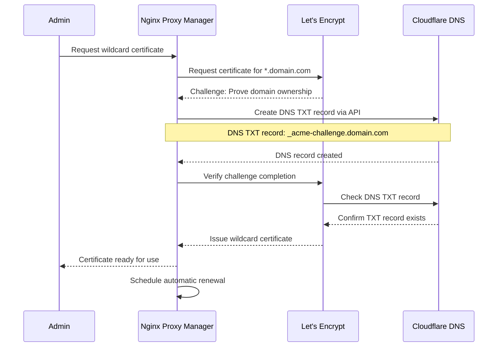
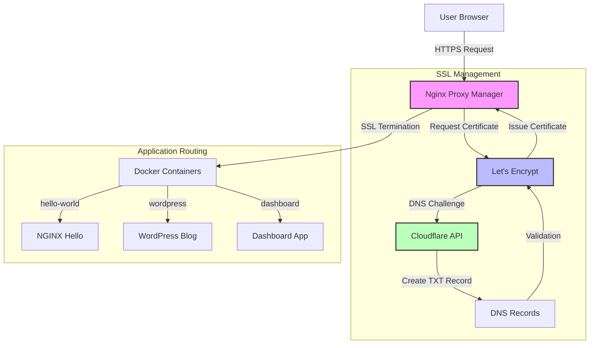
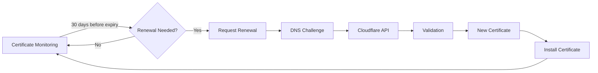

# Step-by-Step Guide: Level Up Your Stack

## Introduction
This guide will walk you through completing Challenge 1, which involves deploying Nginx Proxy Manager as an ingress controller for your Docker hosts, securing it with SSL via Let's Encrypt, and routing multiple applications through it by domain name.

## Preparation
- Install Docker on Ubuntu host
  ```bash
  # Update package index
  sudo apt-get update

  # Install prerequisites
  sudo apt-get install -y apt-transport-https ca-certificates curl software-properties-common

  # Add Docker's official GPG key
  curl -fsSL https://download.docker.com/linux/ubuntu/gpg | sudo apt-key add -

  # Add Docker repository
  sudo add-apt-repository "deb [arch=amd64] https://download.docker.com/linux/ubuntu $(lsb_release -cs) stable"

  # Update package index again
  sudo apt-get update

  # Install Docker CE
  sudo apt-get install -y docker-ce

  # Add current user to docker group to run Docker without sudo
  sudo usermod -aG docker $USER

  # Apply group changes (alternatively, you can log out and log back in)
  newgrp docker

  # Verify Docker installation
  docker --version
  docker run hello-world
  ```

- Install Docker Compose
  ```bash
  # Install Docker Compose
  sudo curl -L "https://github.com/docker/compose/releases/download/v2.18.1/docker-compose-$(uname -s)-$(uname -m)" -o /usr/local/bin/docker-compose
  
  # Apply executable permissions
  sudo chmod +x /usr/local/bin/docker-compose
  
  # Create symbolic link if needed
  sudo ln -s /usr/local/bin/docker-compose /usr/bin/docker-compose
  
  # Verify installation
  docker-compose --version
  ```

## Step 1: Deploy Nginx Proxy Manager

1. Create a project directory for Nginx Proxy Manager:
   ```bash
   mkdir -p ~/nginx-proxy-manager
   cd ~/nginx-proxy-manager
   ```

2. Create a docker-compose.yml file:
   ```bash
   nano docker-compose.yml
   ```

3. Add the following configuration to the docker-compose.yml file:
   ```yaml
   version: '3'
   services:
     app:
       image: 'jc21/nginx-proxy-manager:latest'
       restart: unless-stopped
       ports:
         # Public HTTP Port:
         - '80:80'
         # Public HTTPS Port:
         - '443:443'
         # Admin Web Port:
         - '81:81'
       environment:
         # These are the default environment variables
         DB_MYSQL_HOST: "db"
         DB_MYSQL_PORT: 3306
         DB_MYSQL_USER: "npm"
         DB_MYSQL_PASSWORD: "npm"
         DB_MYSQL_NAME: "npm"
       volumes:
         - ./data:/data
         - ./letsencrypt:/etc/letsencrypt
       depends_on:
         - db

     db:
       image: 'jc21/mariadb-aria:latest'
       restart: unless-stopped
       environment:
         MYSQL_ROOT_PASSWORD: 'npm'
         MYSQL_DATABASE: 'npm'
         MYSQL_USER: 'npm'
         MYSQL_PASSWORD: 'npm'
       volumes:
         - ./data/mysql:/var/lib/mysql
   ```

4. Start the Nginx Proxy Manager:
   ```bash
   docker-compose up -d
   ```

5. Wait for the containers to start (this may take a minute or two):
   ```bash
   docker-compose ps
   ```

## Step 2: Access and Configure Nginx Proxy Manager

1. Access the Nginx Proxy Manager admin interface by navigating to `http://your-server-ip:81` in your web browser.

2. Log in with the default credentials:
   - Email: `admin@example.com`
   - Password: `changeme`

3. You will be prompted to change the default credentials. Set a secure password and update your email address.

4. Familiarize yourself with the interface. The main sections are:
   - Dashboard: Overview of your proxy hosts
   - Proxy Hosts: Where you'll configure your applications
   - SSL Certificates: Where you'll manage SSL certificates
   - Access Lists: For controlling access to your applications

## Step 3: Set Up Sample Applications to Proxy

1. Create a directory for your sample applications:
   ```bash
   mkdir -p ~/sample-apps
   cd ~/sample-apps
   ```

2. Create a docker-compose.yml file for sample applications:
   ```bash
   nano docker-compose.yml
   ```

3. Add the following configuration to set up multiple sample web applications:
   ```yaml
   version: '3'
   services:
     app1:
       image: nginxdemos/hello:latest
       container_name: app1
       restart: unless-stopped
       ports:
         - "8081:80"

     app2:
       image: httpd:latest
       container_name: app2
       restart: unless-stopped
       ports:
         - "8082:80"
       volumes:
         - ./app2-content:/usr/local/apache2/htdocs/

     app3:
       image: jwilder/whoami
       container_name: app3
       restart: unless-stopped
       ports:
         - "8083:8000"
   ```

4. Create content for app2:
   ```bash
   mkdir -p app2-content
   echo "<html><body><h1>This is App 2</h1><p>Running on Apache</p></body></html>" > app2-content/index.html
   ```

5. Start the sample applications:
   ```bash
   docker-compose up -d
   ```

## Step 4: Configure Domain Routing with Nginx Proxy Manager

1. Set up your domain names to point to your server's IP address. You can either:
   - Configure real domain names through your domain registrar (recommended for production)
   - Use a service like nip.io or xip.io for testing (e.g., app1.192.168.1.10.nip.io)
   - Modify your local hosts file for testing

2. In the Nginx Proxy Manager admin interface, go to "Proxy Hosts" and click "Add Proxy Host".

3. Configure the first application (app1):
   - Domain Names: `app1.yourdomain.com` (replace with your actual domain)
   - Scheme: http
   - Forward Hostname / IP: Your server's IP address
   - Forward Port: 8081
   - Check "Block Common Exploits"
   - Click "Save"

4. Repeat the process for app2 and app3, using different domain names and the appropriate ports (8082 and 8083 respectively).

## Step 5: Secure Applications with SSL via Let's Encrypt

### Understanding SSL with Let's Encrypt

Let's Encrypt is a free, automated, and open Certificate Authority that provides SSL certificates. Nginx Proxy Manager integrates with Let's Encrypt to make securing your applications simple.

There are two main methods for domain validation with Let's Encrypt:

1. **HTTP Validation (HTTP-01)**: The default method that verifies domain ownership by placing a file on your server that Let's Encrypt can access via HTTP.
   - Requires your server to be publicly accessible on port 80
   - Works well for public-facing domains
   - Fastest and simplest method

2. **DNS Validation (DNS-01)**: Verifies domain ownership by creating DNS TXT records.
   - Works for internal domains not accessible from the internet
   - Allows wildcard certificates (*.example.com)
   - Requires DNS provider API access or manual DNS record creation

### Setting Up SSL Certificates

1. In the Nginx Proxy Manager admin interface, go to "SSL Certificates" in the left sidebar.

2. Click the "Add SSL Certificate" button in the top right.

3. Select "Let's Encrypt" as the certificate provider.

4. Fill in the form with these details:
   - **Domain Names**: Enter your domain names, one per line (e.g., hello.yourdomain.com)
     - For local testing with .localhost domains, use self-signed certificates instead
   - **Email Address**: Your email address (Let's Encrypt will send expiration notifications)
   - **Check "I Agree to the Terms of Service"**

5. Choose the validation method:
   - For publicly accessible domains: Leave "Use a DNS Challenge" unchecked (HTTP validation)
   - For internal domains or wildcard certificates: Check "Use a DNS Challenge" and follow the DNS provider instructions

6. Click "Save" to request the certificate.

7. Wait for the certificate to be issued (usually takes less than a minute with HTTP validation).

### Applying SSL Certificates to Proxy Hosts

1. Once your certificate is issued, go back to "Proxy Hosts" in the left sidebar.

2. For each proxy host you want to secure:
   - Click the three dots (⋮) on the right side of the proxy host entry
   - Select "Edit"

3. Go to the "SSL" tab in the edit dialog and configure these settings:
   - Check "Enable SSL"
   - Select your newly created certificate from the dropdown
   - Check "Force SSL" (redirects HTTP to HTTPS)
   - Check "HTTP/2 Support" (improves performance)
   - Optionally, enable HSTS if you want strict HTTPS enforcement

4. Click "Save".

5. Repeat for each proxy host you want to secure.

### Testing Your SSL Configuration

1. Access your applications using HTTPS: `https://your-domain-name`

2. Verify that the connection is secure by checking for the padlock icon in your browser.

3. Test HTTP to HTTPS redirection by accessing `http://your-domain-name` and confirming it redirects to HTTPS.

4. You can also use SSL testing tools like [SSL Labs](https://www.ssllabs.com/ssltest/) to verify your configuration.

### Using Self-Signed Certificates for Local Testing

If you're testing locally with .localhost domains or don't have a public domain, you can use self-signed certificates:

1. In the "SSL Certificates" section, click "Add SSL Certificate"

2. Select "Self-Signed Certificate" instead of "Let's Encrypt"

3. Enter your domain names

4. Click "Save"

5. Apply this certificate to your proxy hosts as described above

6. Note: Browsers will show a security warning for self-signed certificates, which you'll need to bypass for testing

## Completion Summary: What We Accomplished

### 1. Nginx Proxy Manager Deployment
- Successfully deployed Nginx Proxy Manager using Docker Compose
- Set up MariaDB database for configuration storage
- Created a shared Docker network for communication between services
- Accessed the admin interface at port 81

### 2. Sample Applications Deployment
- Deployed multiple sample applications using Docker Compose:
  - NGINX Hello World application (hello-world)
  - WordPress blog with MySQL database (wordpress)
  - Simple dashboard application (dashboard)
- Connected all applications to the same shared network as Nginx Proxy Manager
- Verified direct access to applications via their mapped ports

### 3. SSL Certificate Setup with Cloudflare DNS
- Created a wildcard SSL certificate for *.happynoises.work using Let's Encrypt
- Used Cloudflare DNS validation for domain ownership verification
- Successfully issued and installed the certificate
- Configured automatic renewal of certificates

#### Let's Encrypt Wildcard Certificate Process



#### Certificate Application Architecture



#### Certificate Renewal Process



### 4. Domain Routing Configuration
- Set up proxy hosts in Nginx Proxy Manager for each application
- Configured domain routing using subdomains of happynoises.work
- Applied the wildcard SSL certificate to all proxy hosts
- Enabled HTTP to HTTPS redirection for secure access
- Implemented HTTP/2 for improved performance

### 5. Testing and Verification
- Confirmed access to applications via their respective domains
- Verified SSL security with valid Let's Encrypt certificates
- Tested HTTP to HTTPS redirection
- Ensured proper routing between different applications

## Completion Criteria
- ✅ Nginx Proxy Manager is successfully deployed and accessible via the admin interface
- ✅ Multiple applications are running and accessible through the proxy
- ✅ All applications are secured with SSL certificates from Let's Encrypt
- ✅ Each application is accessible via its own domain name
- ✅ HTTP requests are automatically redirected to HTTPS

## Next Steps
- Explore advanced features of Nginx Proxy Manager such as access lists and custom locations
- Set up monitoring for your proxy and applications using tools like Prometheus and Grafana
- Implement container health checks and automatic restarts
- Create a backup strategy for your proxy configuration and SSL certificates
- Explore other reverse proxy solutions like Traefik or HAProxy for comparison
